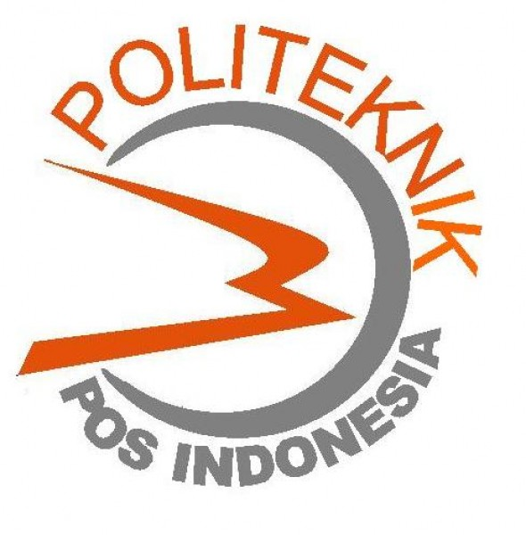

<h3 align="center">SISTEM PERANCANGAN PENGELOLAAN DATA PROPOSAL KARYA ILMIAH MAHASISWA PROGRAM STUDI D4 TI MENGGUNAKAN FRAMEWORK CODEIGNITER BERBASIS WEB </i>   (SUB MODUL : PENGELOLAAN DATA MAHASISWA)</h3>

  

System design data management proposal scientific work of these students is a system to facilitate the coordinators as admin and so did the students in the process of the submission of scientific papers.

## Pre Requisite
**Software**
* Windows Operating System
* Mysql
* Framework CodeIgniter
* Xampp

## Installation
1.
 
2.

## About

NPM| Name| Class | Prodi
------------ | ------------- | ------------- | -------------
1144016| Anggi Sholihatus Sadiah| 3B| D4 Teknik Informatika Politeknik Pos Indonesia

## Reference
1.
 
2.